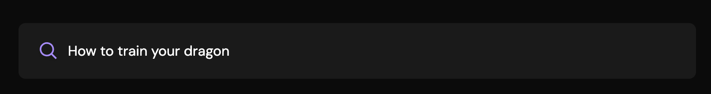
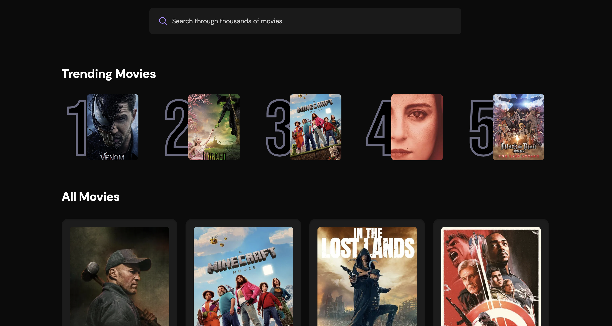

# 🎬 BingeBuddy

BingeBuddy is a sleek and dynamic movie discovery application built with React and Vite. Users can search for thousands of movies, see trending titles based on popularity, and enjoy a clean, responsive UI. BingeBuddy also intelligently tracks and analyzes the most frequently searched movies using Appwrite.

## Live Demo: https://binge-buddy-phi.vercel.app

## 📸 App Screenshots


| Searching for a Movie | 
| :----------------------: |

 

| Trending Movies Section | 
| :----------------------: | 
|  | 

## 🚀 Technologies Used

- **React**: Component-based UI development
- **Vite**: Fast build tool and development server
- **Tailwind CSS**: Utility-first CSS framework for styling
- **Appwrite**: Backend server to store and track search counts for popular movies
- **The Movie Database (TMDB) API**: Source for movie metadata, posters, and ratings

## 📦 Appwrite Integration

Appwrite is used to record and update the number of times each movie title has been searched by users. Each search updates a record in the Appwrite database, allowing BingeBuddy to:

- Track search frequency
- Dynamically display the top 5 trending movies based on search popularity

## ⚡ Debouncing

Debouncing is implemented in `App.jsx` to optimize API requests.  
Instead of sending a request every time a user types a letter, the app waits 500 milliseconds after the user stops typing before making a call to TMDB.  
This improves performance and reduces server load significantly.

```javascript
import { useDebounce } from 'react-use';
...
useDebounce(() => {
  if (query.trim()) {
    fetchMovies(query);
  }
}, 500, [query]);
```

Without debouncing, typing "Harry Potter" would trigger 12 API calls — with debouncing, only one call is made.

## 🛠️ Installation

1. **Clone the repository**
   ```bash
   git clone https://github.com/andrew-ih/BingeBuddy.git
   cd BingeBuddy
   ```

2. **Install dependencies**
   ```bash
   npm install
   ```

3. **Set up environment variables**

Create a `.env.local` file at the project root and add:

```bash
VITE_TMDB_API_KEY=your_tmdb_api_key

VITE_APPWRITE_PROJECT_ID=your_appwrite_project_id
VITE_APPWRITE_DATABASE_ID=your_appwrite_database_id
VITE_APPWRITE_COLLECTION_ID=your_appwrite_collection_id
```

4. **Start the development server**
   ```bash
   npm run dev
   ```

Visit:  
```
http://localhost:5173/
```

---

## 👨‍💻 Author

- GitHub: [Andrew-Ih](https://github.com/andrew-ih)

---

> "Built for movie lovers, powered by clean code." 🚀
